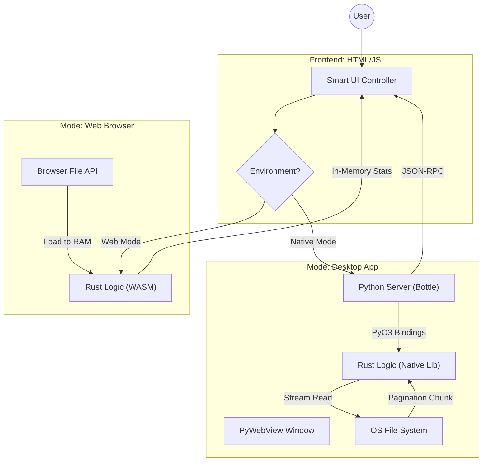

# Rusty Pad: Universal Hybrid-Architecture Workspace


**Rusty Pad** is a high-performance, dual-runtime workspace that combines a distraction-free notepad with a programmable engineer's calculator.

It serves as a Proof of Concept for a **"Write Once, Run Everywhere, Excel Anywhere"** architecture. By leveraging **Rust** as the single source of truth, it achieves two seemingly contradictory goals:

1. **Universal Accessibility:** Runs instantly in any web browser via **WebAssembly (WASM)**.
2. **Native Performance:** Runs as a desktop application via **Python (PyO3)**, capable of opening multi-terabyte files instantly using **Streaming I/O**.

---

## 1. Architectural Philosophy

Modern software often suffers from "Abstraction Bloat" (e.g., loading an entire Chromium instance just to edit text). Rusty Pad challenges this by adhering to strict engineering principles:

### A. The "Hollow Shell" UI Pattern

The HTML/JS interface is strictly a **presentation layer**. It contains **zero** business logic.

* **Math?** Calculated by Rust.
* **Text Stats?** Counted by Rust.
* **File I/O?** Handled by Rust (in Native mode).
The UI simply renders what Rust tells it to, ensuring consistency across Web and Native versions.

### B. O(1) Memory Usage for I/O (Native Mode)

Opening a 10TB log file should not consume 10TB of RAM.
Rusty Pad's native backend implements a **Streaming Architecture**. It never loads a whole file into memory. Instead, it uses a **Pagination Window**, buffering only the kilobytes currently visible to the user, while Rust iterators scan the file on-disk for statistics.

### C. Unified State Management

Whether running in a browser sandbox or on a Linux desktop, the calculation engine (`fend-core`) maintains the same state, unit conversions, and variable definitions.



---

## 2. Key Features

### ⚡ Hybrid Runtime Modes

The application automatically detects its environment and switches strategies:

| Feature | **Web Mode (WASM)** | **Native Mode (Python + Rust)** |
| --- | --- | --- |
| **Distribution** | Static HTML (GitHub Pages) | Standalone Executable / Script |
| **File I/O** | Browser API (Limited by RAM) | **Direct OS I/O (Streaming)** |
| **Max File Size** | ~500MB (Browser dependent) | **Unlimited (TB+)** |
| **Latency** | Near Zero (In-process) | Low (Localhost Loopback) |
| **Core Logic** | `rusty_pad_bg.wasm` | `librusty_pad.so / .pyd` |

### 📝 The Notepad (Streaming & Pagination)

* **Instant Open:** Opens a 100GB file in milliseconds (Native Mode).
* **Pagination:** "Load More" button fetches the next chunk of lines via Rust's `Seek` and `BufReader` logic, keeping memory footprint constant.
* **Real-time Stats:** Character, word, and line counts are computed by highly optimized Rust iterators.

### 🧮 The Engineer's Console (fend-core)

Powered by `fend-core`, the calculator goes beyond simple arithmetic. It supports:

* **Units:** `1 km to miles`, `90 degrees to radians`.
* **Variables:** `tax = 1.1`, then `100 * tax`.
* **Hex/Bin:** `0xFF to decimal`, `0b1010`.
* **Dates:** `date + 3 weeks`.

---

## 3. Directory Structure

```text
rusty-pad/
├── src/
│   └── lib.rs           # THE BRAIN: Shared Rust logic for both WASM and Python.
├── www/
│   ├── index.html       # Universal UI (Buttons, Layout).
│   ├── index.js         # Hybrid Controller (Switches between WASM/API calls).
│   └── pkg/             # (Generated) WASM artifacts.
├── app.py               # NATIVE ADAPTER: Python backend (Bottle server + GUI).
├── tests/
│   ├── test_rusty_pad.py # Unit tests for logic.
│   └── test_streaming.py # Performance verification for TB-scale files.
├── Cargo.toml           # Rust dependency manager (features: wasm, python).
├── pyproject.toml       # Python build configuration (maturin).
└── README.md            # You are here.

```

---

## 4. Setup & Building

### Prerequisites

* **Rust:** `rustup`, `cargo`
* **Python:** 3.8+
* **Tools:**
* `wasm-pack`: For building the Web version.
* `maturin`: For building the Python Native library.
* `uv` (recommended) or `pip`: Python package management.


### Installation of Dependencies

```bash
# 1. Python dependencies for Native Mode
pip install maturin bottle pywebview

# 2. System dependencies (Linux/WSL only)
# Required for PyWebView (GTK)
sudo apt install build-essential libgirepository1.0-dev libcairo2-dev pkg-config python3-dev gir1.2-gtk-3.0

```

---

### Build Strategy A: Web Assembly (GitHub Pages)

This builds the purely client-side version.

```bash
# Build optimized WASM (stripping debug info)
wasm-pack build --target web --out-dir www/pkg --no-default-features --features wasm

# Run locally
cd www
python3 -m http.server 8000
# Access: http://localhost:8000

```

### Build Strategy B: Native App (Python + Rust)

This builds the high-performance desktop version.

```bash
# 1. Compile Rust code into a Python extension module
maturin develop --release --features python

# 2. Launch the Native Application
python app.py

```

---

## 5. Technical Deep Dive: The Streaming Engine

How does **Native Mode** handle a 10TB file?

### The Problem

Traditional editors do this:

```python
# BAD: Loads 10TB into RAM -> Crash
content = open("big_log.txt").read() 

```

### The Rusty Pad Solution

We implement **Zero-Load Analytics** in `src/lib.rs`.

1. **Stat Calculation (`core_stream_stats`):**
Rust opens the file and creates a `BufReader`. It iterates through the byte stream, counting newlines and whitespace *without* keeping the line content in memory.
* *Memory Cost:* Fixed buffer size (e.g., 8KB).
* *Time Complexity:* O(N) where N is file size (limited only by disk read speed).


2. **Pagination (`core_read_lines`):**
When the user requests lines 5000-5010:
```rust
// Simplified Logic
let reader = BufReader::new(file);
for (index, line) in reader.lines().enumerate() {
    if index >= 5000 && index < 5010 {
        buffer.push(line); // Load ONLY these 10 lines
    }
    if index >= 5010 { break; } // Stop reading immediately
}

```


*Note: For even faster random access on fixed-width files, `Seek` operations are used.*

---

## 6. Testing & Validation

Rigorous testing ensures the core logic remains accurate across both runtimes.

### Unit Tests (Logic Verification)

Validates math precision, unit conversions, and text statistics.

```bash
pytest -v tests/test_rusty_pad.py

```

### Performance Benchmarks (Streaming Verification)

Generates a dummy large file (e.g., 100MB - 1GB) and verifies O(1) memory usage.

```bash
python tests/test_streaming.py

```

*Expected Result:* Processing 100MB should take <0.2 seconds on modern SSDs.

---

## 7. License

MIT License. Created for the pursuit of efficiency.