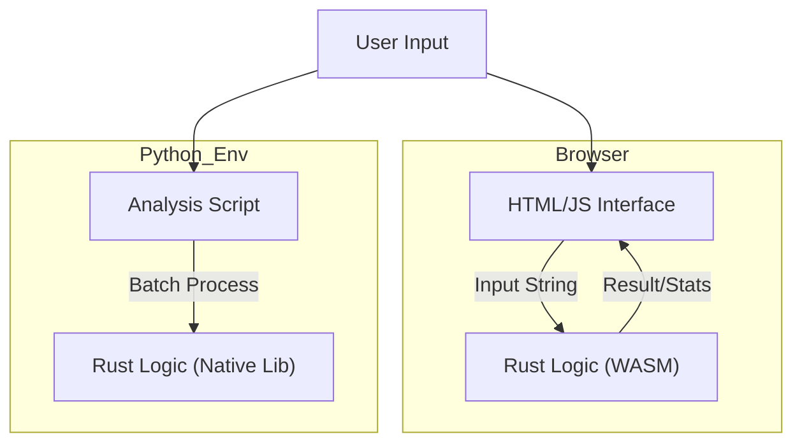

# Rusty Pad: Dual-Runtime Efficiency Proof of Concept


**Rusty Pad** is a minimalistic implementation of a notepad and calculator, designed as an antithesis to modern, bloated software. It demonstrates a rigorous "Write Once, Run Everywhere" architecture where high-performance Rust logic powers both a Web Interface (via WASM) and a Python Analysis Environment (via PyO3).

## 1. Philosophical Architecture

Modern text editors often consume hundreds of megabytes just to display text, primarily due to abstraction overhead (Electron, JVM, etc.). While a browser-based app cannot fully escape the browser's memory footprint, **Rusty Pad** minimizes logical overhead by adhering to the following principles:

1.  **Logic Separation:** All computational logic (math evaluation, text statistics) is strictly implemented in **Rust**.
2.  **Zero-Cost Abstraction:** The UI (HTML/JS) acts merely as a thin presentation layer. It performs no heavy calculations.
3.  **Memory Safety:** Rust's ownership model ensures no memory leaks occur within the core logic, a common issue in long-running JS applications.



## 2. Features

### A. The Notepad

* **Minimal Interface:** Distraction-free typing area.
* **Rust-Powered Analytics:** Real-time character, word, and line counting performed by Rust (compiled to WASM).
* **Local Processing:** Data never leaves your device. Save functionality generates blobs locally.

### B. The Calculator

* **Programmer Mode:** Supports complex expressions like `sqrt(2) * (1 + sin(30))`.
* **Unified Logic:** The exact same calculation engine is used in the Web UI and the Python backend, guaranteeing consistent results across environments.

## 3. Setup & Installation

### Prerequisites

* Rust Toolchain (`rustup`, `cargo`)
* Python 3.8+
* `wasm-pack`: `curl https://rustwasm.github.io/wasm-pack/installer/init.sh -sSf | sh`
* `maturin` (for Python): `pip install maturin`

### A. Building for Web (WASM)

To generate the web artifacts:

```bash
# Build with 'wasm' feature enabled, optimized for size
wasm-pack build --target web --out-dir www/pkg --no-default-features --features wasm

# Serve locally
cd www
python3 -m http.server 8000
# Visit http://localhost:8000

```

### B. Building for Python

To use the core logic in Python scripts:

```bash
# Build and install into current virtual environment
maturin develop --release --features python

# Run verification
python test_script.py

```

## 4. Technical Deep Dive

### Why `meval` for Math?

We chose the `meval` crate for expression parsing. It provides a distinct advantage over JavaScript's `eval()`:

* **Security:** It does not execute arbitrary code, only mathematical expressions.
* **Determinism:** Floating-point operations are handled by Rust's strict adherence to IEEE 754, avoiding some JS-specific quirks.

### Memory Profile

While the browser container introduces base overhead, the WASM module itself is extremely compact (typically <100KB gzipped). The text buffer statistics are computed by passing a pointer to the WASM linear memory, minimizing GC pressure on the JS side compared to pure JS implementations that might create many intermediate string objects.

## 5. Directory Structure

```
rusty-pad/
├── src/
│   └── lib.rs           # Single Source of Truth (Core Logic)
├── www/
│   ├── index.html       # Minimalist UI
│   ├── index.js         # WASM Glue Code
│   └── pkg/             # Generated WASM (ignored by git)
├── Cargo.toml           # Defines features (wasm vs python)
├── test_script.py       # Python integration test
└── README.md            # Documentation

```
